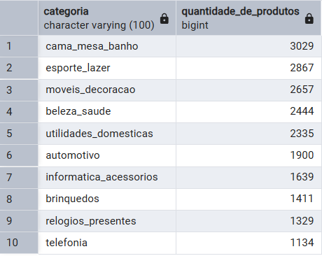
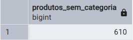
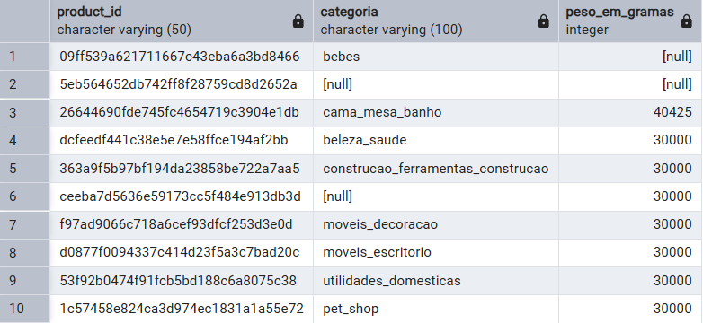
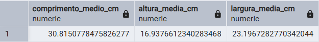
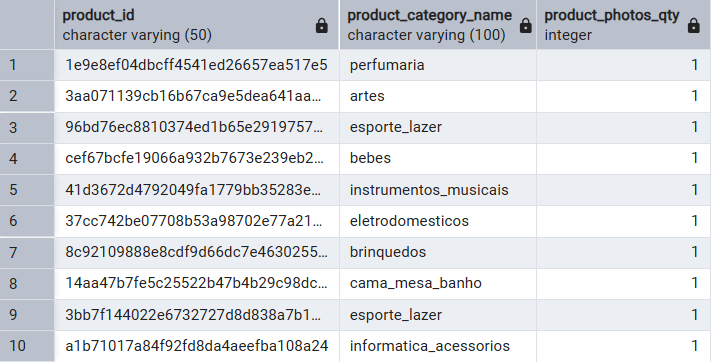

# Exercício 6: Análise de um Dataset Real com SQL

Neste último exercício, o desafio foi pegar um arquivo de dados do mundo real (um CSV) e usar o SQL para descobrir informações úteis nele. A ideia era passar por todo o processo: arrumar os dados, importar para o PostgreSQL e depois fazer as perguntas certas para ver o que os dados nos contavam.

---

## Preparando o Terreno: A Importação dos Dados

O primeiro passo foi criar uma "caixa" vazia no banco de dados para receber os dados do CSV. A tabela `olist_produtos` foi criada com colunas compatíveis com as do arquivo, usando o seguinte código:

```sql
CREATE TABLE olist_produtos (
    product_id VARCHAR(50),
    product_category_name VARCHAR(100),
    product_name_lenght INTEGER,
    product_description_lenght INTEGER,
    product_photos_qty INTEGER,
    product_weight_g INTEGER,
    product_length_cm INTEGER,
    product_height_cm INTEGER,
    product_width_cm INTEGER
);
```

Com a tabela pronta, usei a ferramenta de `Import/Export` do pgAdmin para carregar os mais de 32.000 registros de produtos do arquivo `olist_products_dataset.csv`. O passo mais importante foi marcar a opção "Header", para que o programa entendesse que a primeira linha era o nome das colunas.

---

## Análise de Dados: 5 Perguntas e Respostas

Com o banco de dados populado, comecei a fazer perguntas usando o SQL.

### 1. Quais são as categorias com mais produtos na loja?

* **Código SQL:**
    ```sql
    SELECT 
        product_category_name AS categoria, 
        COUNT(*) AS quantidade_de_produtos
    FROM 
        olist_produtos
    GROUP BY 
        product_category_name
    ORDER BY 
        quantidade_de_produtos DESC
    LIMIT 10;
    ```
* **O que eu descobri:** A análise mostra claramente quais são as categorias mais fortes da loja. A categoria **`cama_mesa_banho` lidera com 3.029 produtos**, seguida de perto por **`esporte_lazer` (2.867)** e **`moveis_decoracao` (2.657)**. Isso indica que o foco do negócio está em produtos para casa e estilo de vida, sendo estas as áreas onde a empresa tem a maior variedade de ofertas.
* **Resultado:**

    

### 2. Será que temos produtos sem categoria cadastrada?

* **Código SQL:**
    ```sql
    SELECT COUNT(*) AS produtos_sem_categoria
    FROM olist_produtos
    WHERE product_category_name IS NULL;
    ```
* **O que eu descobri:** A consulta revelou um problema real de qualidade de dados. Existem exatamente **610 produtos** sem uma categoria associada. Este é um número significativo que pode estar prejudicando as vendas, já que esses produtos são mais difíceis de serem encontrados pelos clientes. É uma tarefa de limpeza de dados que precisa ser feita.
* **Resultado:**

    

### 3. Quais são os produtos mais pesados?

* **Código SQL:**
    ```sql
    SELECT 
        product_id,
        product_category_name AS categoria,
        product_weight_g AS peso_em_gramas
    FROM 
        olist_produtos
    ORDER BY 
        product_weight_g DESC
    LIMIT 10;
    ```
* **O que eu descobri:** Este relatório é super importante para a logística. O produto mais pesado encontrado tem mais de **40kg (40425 gramas)** e pertence à categoria `cama_mesa_banho`. Muitos outros produtos no topo da lista pesam **30kg**. Isso mostra que a loja vende itens grandes e pesados, principalmente móveis, que definitivamente precisam de um planejamento de frete e embalagem especial. Também notei que alguns produtos pesados não têm categoria (`[null]`), outro ponto de melhoria nos dados.
* **Resultado:**

    

### 4. Qual o tamanho médio dos produtos?

* **Código SQL:**
    ```sql
    SELECT 
        AVG(product_length_cm) AS comprimento_medio_cm,
        AVG(product_height_cm) AS altura_media_cm,
        AVG(product_width_cm) AS largura_media_cm
    FROM 
        olist_produtos;
    ```
* **O que eu descobri:** Calculei as dimensões médias de um produto do catálogo. Em média, um item tem aproximadamente **31cm de comprimento, 17cm de altura e 23cm de largura**. Isso dá uma ideia concreta do tamanho de uma "caixa padrão" para a loja, ajudando a otimizar a compra de embalagens e o planejamento do espaço no armazém.
* **Resultado:**

    

### 5. Existem produtos com poucas fotos?

* **Código SQL:**
    ```sql
    SELECT 
        product_id,
        product_category_name,
        product_photos_qty
    FROM 
        olist_produtos
    WHERE 
        product_photos_qty <= 1
    LIMIT 10;
    ```
* **O que eu descobri:** A consulta gerou uma lista de produtos com potencial de venda baixo por falta de apelo visual. Vemos que produtos de categorias muito diferentes, como **`perfumaria`**, **`instrumentos_musicais`** e **`brinquedos`**, sofrem com apenas uma foto. Isso não é um problema isolado de uma área, mas algo que precisa de atenção em todo o site para melhorar as vendas.
* **Resultado:**

    

---
